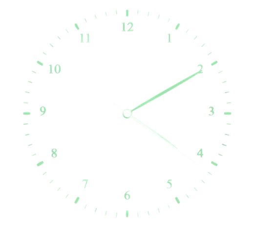

    

# Horloge Analogique

L'objectif est de crée une horloge analogique a l'aide des languages HTML CSS JS.

## Demo du projet

https://codepen.io/RyanQueva/pen/wvZXoxy
Ou 
https://beloow.github.io/Horloge-Analogique/

## Authors

- [@beloow](https://www.github.com/beloow)

## References des couleurs

| Color             | Hex                                                                    |
| ----------------- | ---------------------------------------------------------------------- |
| bg-color |  #1f242d |
| main-color |  #A0E5AF |